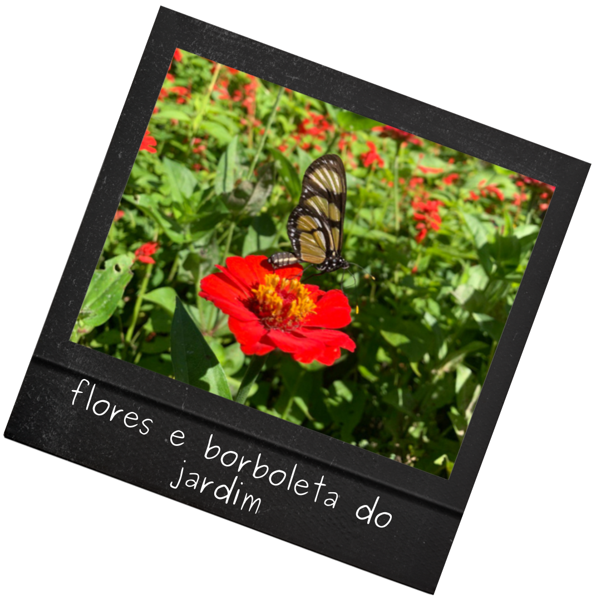

class: middle

<link href="https://cdn.jsdelivr.net/npm/bootstrap@5.0.0-beta3/dist/css/bootstrap.min.css" rel="stylesheet" integrity="sha384-eOJMYsd53ii+scO/bJGFsiCZc+5NDVN2yr8+0RDqr0Ql0h+rP48ckxlpbzKgwra6" crossorigin="anonymous">
<script src="https://cdn.jsdelivr.net/npm/bootstrap@5.0.0-beta3/dist/js/bootstrap.bundle.min.js" integrity="sha384-JEW9xMcG8R+pH31jmWH6WWP0WintQrMb4s7ZOdauHnUtxwoG2vI5DkLtS3qm9Ekf" crossorigin="anonymous"></script>

```{r setup, include=FALSE}
options(htmltools.dir.version = FALSE)
```

```{r xaringan-themer, include=FALSE, warning=FALSE}
library(xaringanthemer)
style_duo_accent(
  primary_color = "#1381B0",
  secondary_color = "#FF961C",
  inverse_header_color = "#FFFFFF"
)
```

# Feliz dia de seu nome!  🎉


.pull-left[
Oi Julio! Feliz aniversário! 🥳

Eu gosto muito de presentear pessoas queridas com flores do jardim. Sinto como se eu estivesse dividindo um pouco deste lugar que é tão especial pra mim!
Infelizmente não posso entregar esse presente pessoalmente, então envio com muito carinho este cartão.


Neste seu aniversário, desejo todas as coisas boas pra você. 🎈🎂🥳


]


.pull-right[


Que você tenha muita felicidade, saúde, paz, amor, vacina 💉 e muitos anos de vida para explorar novos pacotes, assistir muitas coisas nerds, e aproveitar muito com as pessoas que você ama.


Você é uma pessoa muito especial, e é um grande privilégio ter na minha vida alguém que me inspira tanto, e que eu admiro muito também! ❤️

.right[

De: Bea. Para: Jubs, 01 de abril de 2021]
]

---

<div class="biscoito-360-rotate biscoito-360-right"></div>

.pull-left[

```{r echo=FALSE, out.width="70%", fig.align="center"}

```


<div class="card text-dark bg-light mb-3" style="width: 25rem;">
  <div class="card-body">
    <h5 class="card-title">VALE PASSEIO NO JARDIM DA CASA DA BEA</h5>
    <h6 class="card-subtitle mb-2 text-muted">Validade: Indeterminada</h6>
    <p class="card-text">Utilização: Pode ser usado quando for seguro. <br> </p>
  </div>
</div>


]


.pull-right[
<br><br><br><br><br><br><br><br>

<div class="card text-dark bg-light mb-3" style="width: 25rem;">
  <div class="card-body">
    <h5 class="card-title">VALE BISCOITO</h5>
    <h6 class="card-subtitle mb-2 text-muted">Validade: Indeterminada</h6>
    <p class="card-text">Utilização: Pode ser usado quando quiser. <br> 
    <h6 class="card-subtitle mb-2 text-muted">Obs: Não que seja necessário, os meus biscoitos são garantidos 🤣</h6></p>

  </div>
</div>


]
